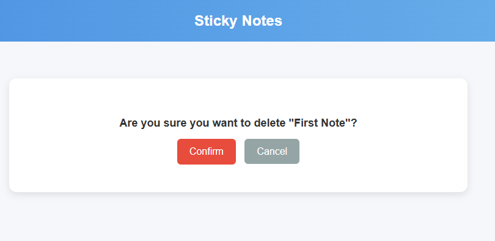

# STICKY NOTES APP

A simple and intuitive Django-based web application for creating, reading, 
updating, and deleting sticky notes. This project demonstrates the 
implementation of CRUD (Create, Read, Update, Delete) functionality 
using Django's Model-View-Template (MVT) architecture.

---

## Features

- **Create Notes**: Add new sticky notes with a title and content.
- **Read Notes**: View a list of all notes and their details.
- **Update Notes**: Edit existing notes to update their title or content.
- **Delete Notes**: Remove notes that are no longer needed.
- **Unit Tests**: Includes comprehensive unit tests for models and views

## Technologies Used

- **Backend**: Django (Python)
- **Frontend**: HTML, CSS, Bootstrap
- **Database**: SQLite (default Django database)
- **Testing**: Django TestCase

---

## Sticky Notes Application Design

This document describes the design of the Sticky Notes application using 
Use Case, Sequence, and Class diagrams.


## Use Case Diagram

The Use Case Diagram illustrates the main interactions between the user 
and the system.


## Sequence Diagram
The Sequence Diagram shows the flow of actions when a user creates a new note


##  Class Diagram
The Class Diagram represents the structure of the application's models and views


---

## Installation

1. Clone the repository:
   ```bash
   git clone https://github.com/LesiaUKR/django_sticky_notes_project.git
   ```
2. Navigate to the project directory:

```bash
cd sticky-notes-django
```
3. Create a virtual environment and activate it:

```bash
python -m venv myenv
source myenv/bin/activate  # On Windows: myenv\Scripts\activate
```
4. Install the required dependencies:

```bash
pip install -r requirements.txt
```
5. Apply migrations:

```bash
python manage.py makemigrations
python manage.py migrate
```
6. Run the development server:

```bash
python manage.py runserver
```
7. Open your browser and navigate to http://127.0.0.1:8000.

---

## Running Tests
To run the unit tests, use the following command:

```bash
python manage.py test notes
```
---

## Screenshots

### 1. Sticky notes list view

### 2. Sticky notes create/update view

### 3. Sticky notes confirm deletion view
